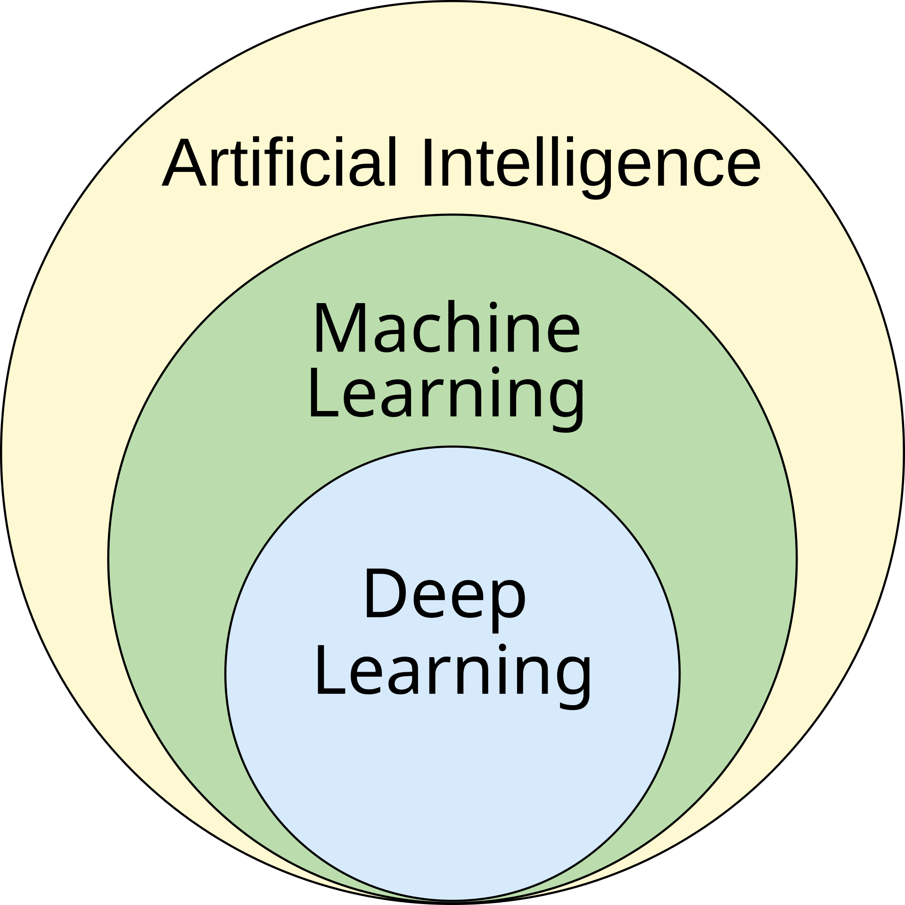
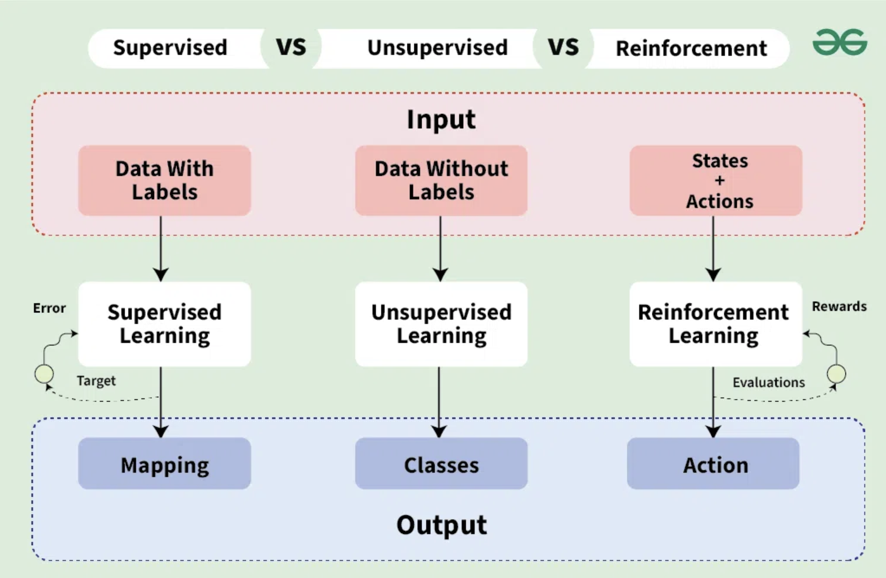

# What is Machine Learning?

Machine learning (ML) is a field of study in artificial intelligence concerned with the development and study of statistical algorithms that can learn from data and generalize to unseen data, and thus perform tasks without explicit instructions. Advances in the field of deep learning have allowed neural networks to surpass many previous approaches in performance.

The following graph shows relationship between three key concepts: Artificial Intelligence (AI), Machine Learning (ML) and Deep Learning (DL).

(image from [wikipedia](https://en.wikipedia.org/wiki/Machine_learning))

## Classifications

### 1. Classification by Signal
Machine learning methods can be categorized based on the type of signal they receive during training:

(image from [Geeks for Geeks](https://www.geeksforgeeks.org/supervised-vs-reinforcement-vs-unsupervised/))

#### 1.1 Supervised Learning
- **Definition**: The model is trained on labeled data, where each input is paired with a corresponding output.
- **Examples**: Regression, classification tasks.
- **Use Case**: Predicting house prices, spam email detection.

#### 1.2 Unsupervised Learning
- **Definition**: The model is trained on unlabeled data, aiming to find patterns or structures in the input.
- **Examples**: Clustering, dimensionality reduction.
- **Use Case**: Customer segmentation, data compression.

#### 1.3 Reinforcement Learning
- **Definition**: The model learns by interacting with an environment, receiving rewards or penalties based on its actions.
- **Examples**: Q-learning, Deep Q-Networks (DQN).
- **Use Case**: Game playing (e.g., AlphaGo), robotic control.

### 2. Classification by Model Type
Machine learning models can also be classified based on whether they make assumptions about the data's distribution or complexity:

#### 2.1 Parametric Learning
- **Definition**: Assumes a fixed form (or parameters) for the model. The number of parameters does not grow with the size of the training data.
- **Examples**: Linear regression, Logistic regression, Naive Bayes.
- **Advantages**: 
  - Simpler to implement and compute.
  - Requires less data to train.
- **Limitations**: Less flexible, may not capture complex patterns.

#### 2.2 Non-Parametric Learning
- **Definition**: Does not assume a fixed form for the model. The complexity grows with the training data.
- **Examples**: k-Nearest Neighbors (kNN), Decision Trees, Support Vector Machines (SVMs), Neural Networks.
- **Advantages**: 
  - Flexible, can capture complex patterns.
  - Performs well with large datasets.
- **Limitations**: Requires more data and computational resources.

# What will we learn in this TB?

- Workshop 6: Intro to Machine Learning, Linear Regression, Logistic Regression
- Workshop 7: Decision Tree, Random Forest
- Workshop 8: Support Vector Machine (SVM), Principal Component Analysis (PCA), Data Preprocessing
- Workshop 9: K-Nearest Neighbours (KNN), K-Means, Gaussian Mixture Models (GMM)
- Workshop 10: Intro to deep learning and neural networks, multilayer perceptron (MLP)

# Prerequisites

1. Python Basics

   All the Python knowledge needed for machine learning is available in previous workshop materials.

   - Workshop 1: variables, data types, operators, control flows, functions and modules
   - Workshop 2: data structures, object-oriented programming (OOP)
   - Workshop 3: numpy (comprehensive functionalities for scientific computing)
   - Workshop 4: pandas (data analysis)
   - Workshop 5: matplotlib.pyplot (data visualisation)

   The last three workshops are important as you can find the usage of them in everywhere of machine learning, make sure you fully understand contents in these materials.

2. Jupyter Notebook

   You can use Jupyter by [Google Colab](https://colab.research.google.com/) or Installing [Anaconda](https://www.anaconda.com/products/distribution#download-section)/[Miniconda](https://docs.conda.io/en/latest/miniconda.html).
